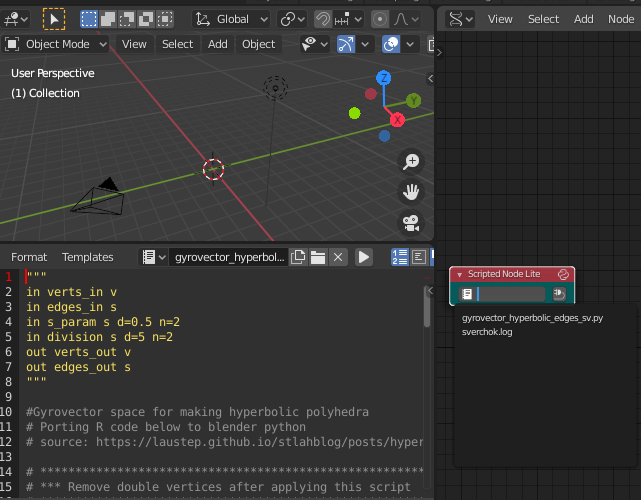
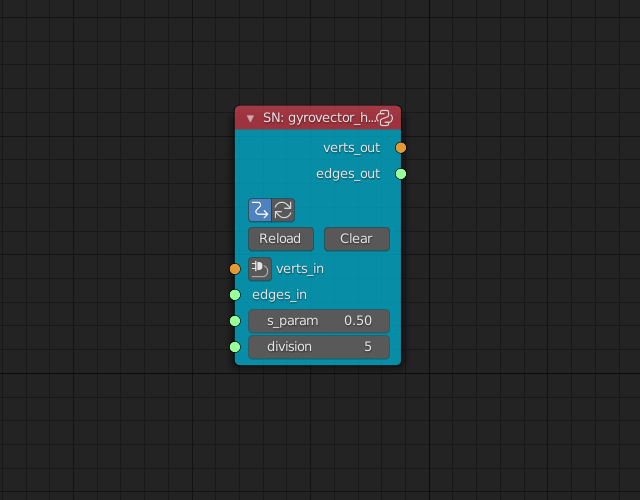
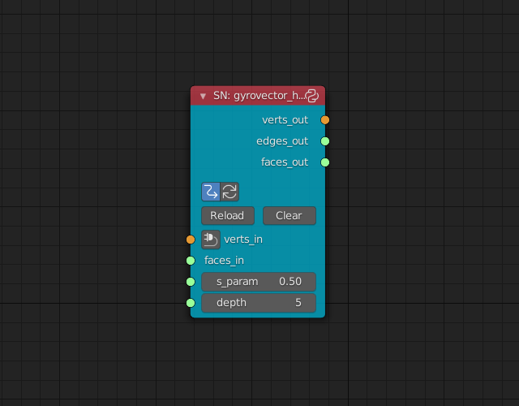
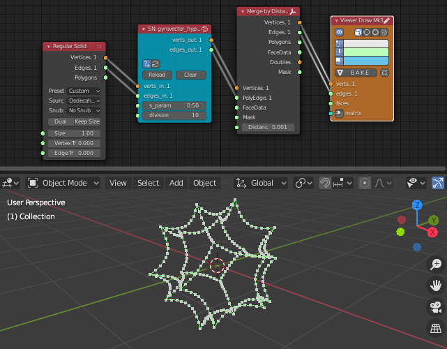
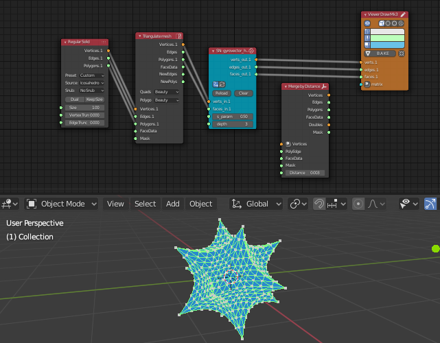

# Gyrovector Hyperbolic geometry in Blender with add-ons

## Description

This repository offers scripts to simulate hyperbolic space with gyrovector approach in Blender using sverchok and animation node add-ons.

Scripts in this repositody are based on this original page:
https://laustep.github.io/stlahblog/posts/hyperbolicPolyhedra.html

## Installation

### sverchok

* Download ./sverchok/gyrovector_edges.py (or ./sverchok/gyrovector_polygons.py)
* Open Blender and load the script in Blender's text editor
* Add SNLite script node in sverchok node tree
* Select gyrovector_hyperbolic_edges.py (or gyrovector_hyperbolic_polygons.py) in the text area of SNLite script node

### animation nodes

Gyrovector script for animation nodes add-on is also stored in this repository. You can load the script for animation nodes in animation-nodes editor like sverchok, so the rest details are skipped.

## Usage

### sverchok

After loading script in SNLite script node, the nodes will show its parameters. Set the parameters with connecting nodes.

#### gyrovector_edges.py  

Parameters:  
  - In
    - verts_in:&emsp; Vertices of the source object
    - edges_in:&emsp; Edges of the source object
    - s_param:&emsp; fixed positive number
    - division:&emsp; number of edge division
  - Out
    - verts_out:&emsp; Vertices
    - edges_out:&emsp; Edges

#### gyrovector_polygons.py  
   

Parameters:
  - In
    - verts_in:&emsp; Vertices of the source object
    - faces_in:&emsp; Faces of the source object
    - s_param:&emsp; fixed positive number
    - division:&emsp; number of edge division
  - Out
    - verts_out:&emsp; Vertices
    - edges_out:&emsp; Edges
    - faces_out:&emsp; Faces

  
This images are some node-tree examples.

Result edges are splitted at the original vertices positions, so you need to use 'Merge by Distance' node to remove double vertices.

And when creating polygons, source meshes are needed to **be triangulated in advance** with 'Triangulate mesh' node.

### animation nodes

Usage for animation nodes is similar to the sverchok's node. So the details in animation nodes are skipped.

## Requirements

* Blender 2.8 (or later)
* sverchok add-on 0.6 (or later)
* animation nodes add-on 2.1.7 (or later)

## Author

asahidari

## License

[GPL 3](https://www.gnu.org/licenses/quick-guide-gplv3.html)

